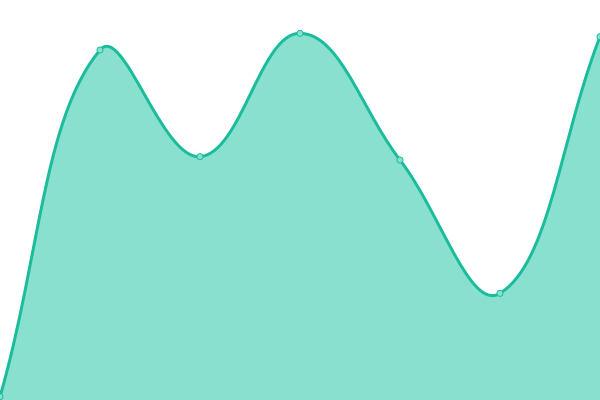
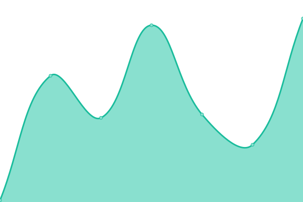

# [📈 Live Status](https://status.saxobroko.com): <!--live status--> **🟧 Partial outage**

This repository contains the open-source uptime monitor and status page for [Upptime](https://upptime.js.org), powered by [Upptime](https://github.com/upptime/upptime).

With [Upptime](https://upptime.js.org), you can get your own unlimited and free uptime monitor and status page, powered entirely by a GitHub repository. We use [Issues](https://github.com/upptime/upptime/issues) as incident reports, [Actions](https://github.com/upptime/upptime/actions) as uptime monitors, and [Pages](https://status.saxobroko.com) for the status page.

<!--start: status pages-->
<!-- This summary is generated by Upptime (https://github.com/upptime/upptime) -->
<!-- Do not edit this manually, your changes will be overwritten -->
<!-- prettier-ignore -->
| URL | Status | History | Response Time | Uptime |
| --- | ------ | ------- | ------------- | ------ |
|  [Home](https://saxobroko.com) | 🟥 Down | [home.yml](https://github.com/saxobroko/SaxoStatus/commits/HEAD/history/home.yml) | 

 88ms
     
 | 

<a href="https://status.saxobroko.com/history/home">100.00%</a>
    

|  [Blog](https://blog.saxobroko.com) | 🟥 Down | [blog.yml](https://github.com/saxobroko/SaxoStatus/commits/HEAD/history/blog.yml) | 

 84ms
     
 | 

<a href="https://status.saxobroko.com/history/blog">100.00%</a>
    

|  [PhotoShare](https://share.saxobroko.com) | 🟥 Down | [photo-share.yml](https://github.com/saxobroko/SaxoStatus/commits/HEAD/history/photo-share.yml) | 

 82ms
     
 | 

<a href="https://status.saxobroko.com/history/photo-share">100.00%</a>
    

|  [Alt](https://alt.saxobroko.com) | 🟥 Down | [alt.yml](https://github.com/saxobroko/SaxoStatus/commits/HEAD/history/alt.yml) | 

 97ms
     
 | 

<a href="https://status.saxobroko.com/history/alt">100.00%</a>
    

|  [Alt2](https://alt2.saxobroko.com) | 🟥 Down | [alt2.yml](https://github.com/saxobroko/SaxoStatus/commits/HEAD/history/alt2.yml) | 

 71ms
     
 | 

<a href="https://status.saxobroko.com/history/alt2">100.00%</a>
    

|  [ipfs](https://ipfs.saxobroko.com) | 🟩 Up | [ipfs.yml](https://github.com/saxobroko/SaxoStatus/commits/HEAD/history/ipfs.yml) | 

 774ms
     
 | 

<a href="https://status.saxobroko.com/history/ipfs">100.00%</a>
    

|  [Discord Bot](https://music.saxobroko.com) | 🟩 Up | [discord-bot.yml](https://github.com/saxobroko/SaxoStatus/commits/HEAD/history/discord-bot.yml) | 

 353ms
     
 | 

<a href="https://status.saxobroko.com/history/discord-bot">100.00%</a>
    

<!--end: status pages-->

[**Visit our status website →**](https://status.saxobroko.com)

## 📄 License

- Powered by: [Upptime](https://github.com/upptime/upptime)
- Code: [MIT](./LICENSE) © [Upptime](https://upptime.js.org)
- Data in the `./history` directory: [Open Database License](https://opendatacommons.org/licenses/odbl/1-0/)
